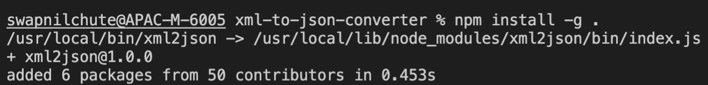
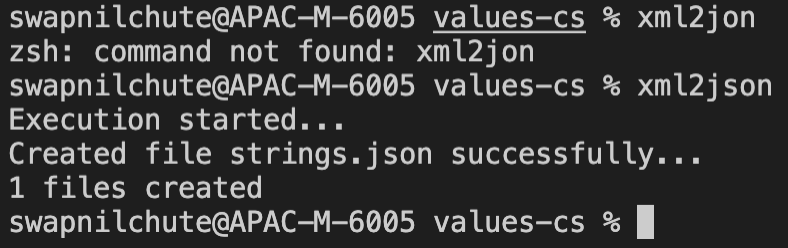

# xml-to-json-converter

xml to json converter

Steps to use xml2json converter

1. Clone Repository `git@github.com:coupa-swapnil/xml-to-json-converter.git`
2. Go to cloned repository folder
3. Run command `npm install -g .`
   
4. Go to folder where you have xml file to be converted and execute command `xml2json`
   
